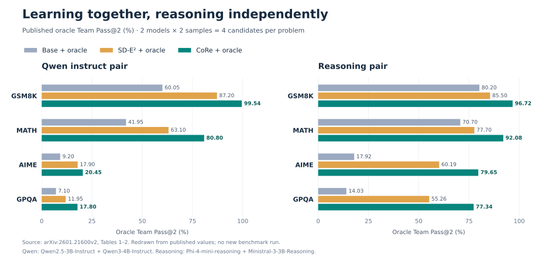
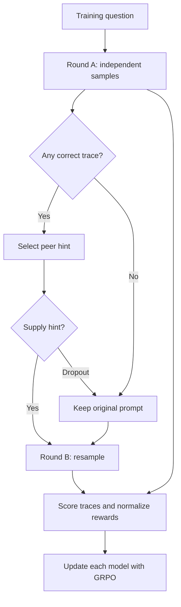

<div align="center">

# CoRe
### Collaborative Reasoning via Cross Teaching

**Kshitij Mishra · Mirat Aubakirov · Martin Takac · Nils Lukas · Salem Lahlou**

Mohamed bin Zayed University of Artificial Intelligence

[](https://arxiv.org/abs/2601.21600v2)
[](#quick-start)
[](#training)
[](https://github.com/Mishrakshitij/CoRe/actions/workflows/tests.yml)

[**Paper**](https://arxiv.org/pdf/2601.21600v2) · [**Results**](#published-results) · [**Method**](#how-core-works) · [**Quick start**](#quick-start) · [**Training**](#training) · [**Evaluation**](#evaluation) · [**Citation**](#citation)

</div>

CoRe turns a successful peer's reasoning into a training signal. Models first attempt a problem independently, then learn from an optional peer hint in a second round. Correctness, complementary reasoning, and successful recovery shape the reward. **After training, each model reasons from the original question, without peer hints.**

This repository provides LoRA training, cold generation, team evaluation, configuration presets, and regression checks. Start with the [`core/`](core) package; [implementation and reproducibility notes](docs/reproducibility.md) document the experimental choices and validation scope.

## Published results

[](assets/paper-results.svg)

**Paper results, not a new benchmark run.** The figure redraws Tables 1–2 of [arXiv:2601.21600v2](https://arxiv.org/pdf/2601.21600v2#page=7). Every bar uses the same **oracle Team Pass@2** definition: two samples per model, **four candidate solutions per problem**, and success if any candidate is correct. Oracle selection uses gold answers; majority vote is reported separately below.

<details>
<summary><strong>Explore the exact benchmark results</strong></summary>

All values are percentages. Qwen denotes **Qwen2.5-3B-Instruct + Qwen3-4B-Instruct**; reasoning pair denotes **Phi-4-mini-reasoning + Ministral-3-3B-Reasoning**.

| Model pair | Training | GSM8K | MATH | AIME | GPQA |
| :--- | :--- | ---: | ---: | ---: | ---: |
| Qwen | Base + oracle | 60.05 | 41.95 | 9.20 | 7.10 |
| Qwen | SD-E² + oracle | 87.20 | 63.10 | 17.90 | 11.95 |
| Qwen | **CoRe + oracle** | **99.54** | **80.80** | **20.45** | **17.80** |
| Reasoning pair | Base + oracle | 80.20 | 70.70 | 17.92 | 14.03 |
| Reasoning pair | SD-E² + oracle | 85.50 | 77.70 | 60.19 | 55.26 |
| Reasoning pair | **CoRe + oracle** | **96.72** | **92.08** | **79.65** | **77.34** |

Source: [Tables 1–2](https://arxiv.org/pdf/2601.21600v2#page=7). The paper uses the official GSM8K test set and constructed MATH/AIME/GPQA splits; see [§5.1](https://arxiv.org/html/2601.21600v2#S5.SS1) before comparing against other leaderboards. Training uses at most 1,000 examples per run.

[Source data](assets/paper-results.json) · [Figure generation script](assets/plot_results.py) · [Individual model results in the paper](https://arxiv.org/pdf/2601.21600v2#page=7)

</details>

<details>
<summary><strong>Beyond the oracle: answer selection on AIME</strong></summary>

The paper also evaluates a **three-model** team: Phi-4-mini-reasoning, Ministral-3-3B-Reasoning, and Ministral-3-8B-Reasoning. This is a separate setting from the two-model comparison above.

| Selection strategy | Reported AIME score (%) |
| :--- | ---: |
| Best single model | 78.45 |
| Agreement-gated team | 80.40 |
| **Majority-vote team** | **81.20** |
| Oracle Team Pass@2 | 82.60 |

Source: [Table 3, §6.1](https://arxiv.org/pdf/2601.21600v2#page=8). Team Pass@2 uses two samples per model, hence six candidates for this team. Voting and agreement are selectors without gold access; oracle success is an upper bound. The paper labels this table AIME Pass@2.

</details>

## How CoRe works



The reward combines **correctness**, **diversity**, and a **rescue bonus** when a previously unsuccessful model recovers with a hint. Teacher hints are derived from correct traces, with explicit final-answer lines removed. The protocol is described in [§4 and Algorithm 1](https://arxiv.org/html/2601.21600v2#S4); this package implements the GRPO training path.

## Quick start

Use **Python 3.10+** and run commands from the repository root.

```bash
git clone https://github.com/Mishrakshitij/CoRe.git
cd CoRe
python -m venv .venv
source .venv/bin/activate
python -m pip install -r requirements-paper.txt
```

Choose a PyTorch build compatible with your GPU and CUDA environment. The trainer uses an explicit device for each model and LoRA adapters; edit the model/device configuration for your machine.

<details>
<summary><strong>Try the interfaces on CPU, without loading model weights</strong></summary>

These commands need only NumPy and can be run in a separate lightweight environment:

```bash
python -m pip install 'numpy>=1.26,<3'
python -m unittest discover -s tests -v
python -m core.cli \
  --config configs/paper_qwen.json \
  --data examples/train.jsonl --validate-only
python -m core.evaluation examples/predictions.jsonl --k 2
```

The included examples are synthetic interface fixtures. Tensor tests run when PyTorch is installed and explicitly skip otherwise.

</details>

## Training

Prepare JSONL data with stable, unique IDs and final answers:

```json
{"id":"example-001","question":"What is 7 + 5?","answer":"12"}
```

```bash
python -m core.cli \
  --config configs/paper_qwen.json \
  --data data/train.jsonl \
  --output-dir outputs/core-qwen-run1
```

Use a separate held-out manifest for evaluation. For multiple-choice tasks, include the options in `question` and use a consistent answer label.

<details>
<summary><strong>Choose a model pair and inspect the training preset</strong></summary>

| Configuration | Model pair |
| :--- | :--- |
| [`paper_qwen.json`](configs/paper_qwen.json) | `Qwen/Qwen2.5-3B-Instruct` + `Qwen/Qwen3-4B-Instruct-2507` |
| [`paper_reasoning.json`](configs/paper_reasoning.json) | Phi-4-mini-reasoning + Ministral-3-3B-Reasoning |

Pin model and tokenizer revisions for your experiment. The dated Qwen3 identifier is an explicit implementation choice for the paper's shortened name. The Ministral path uses Transformers 5 and `mistral-common`, included in the requirements.

| Setting | Preset |
| :--- | ---: |
| Cold samples per model, K | 2 |
| Round B samples per model, K′ | 1 |
| Probability of supplying a hint | 0.75 |
| Hint budget | 1,536 tokens |
| Training completion budget | 3,072 tokens |
| Round B loss weight | 0.8 |
| LoRA rank / alpha | 16 / 32 |
| Learning rate | 1e-5 |
| Semantic / structural distance weights | 0.6 / 0.4 |

The trainer retains generated token IDs and prompt context, freezes old/reference log probabilities before model updates, and normalizes advantages across both models and rounds for each problem. Runs save configuration, data manifests, metrics, and adapters; optional rollout logging retains prompts and samples. Adapter exports support inference. They do not include optimizer/RNG state for resuming training, and nonempty output directories are protected from overwrite.

See [reproducibility notes](docs/reproducibility.md) for preset decisions, dependency scope, reward interpretation, and GPU validation status.

</details>

## Evaluation

Generate cold completions from exported adapters and score them:

```bash
python -m core.generate \
  --config outputs/core-qwen-run1/config.json \
  --checkpoint-dir outputs/core-qwen-run1/final \
  --data data/test.jsonl \
  --k 2 --max-new-tokens 4096 \
  --output outputs/core-qwen-pass2.jsonl

python -m core.evaluation outputs/core-qwen-pass2.jsonl \
  --k 2 --output outputs/core-qwen-pass2-metrics.json
```

<details>
<summary><strong>Evaluation options, prediction format, and metric definitions</strong></summary>

Omit `--checkpoint-dir` to evaluate base models. For greedy Pass@1, use `--k 1 --greedy` and a new output filename. `--validate-only` checks inputs without loading weights. Generation records tokenizer counts and a metadata sidecar with decoding settings and completion status.

The scorer accepts JSONL rows containing `example_id`, `model`, `gold`, and a list of `completions`. Optional `token_counts` must align with every completion. IDs must match across models; row order is flexible. See the [prediction example](examples/predictions.jsonl).

| Metric | Meaning |
| :--- | :--- |
| Individual Pass@K | Any of one model's first K samples is correct |
| Oracle Team Pass@K | Any collaborator produces a correct sample; two models at K=2 use four candidates |
| Majority-vote accuracy | Most frequent extracted answer, with deterministic tie handling |
| Collaboration gain | Oracle team score minus the best individual score |

Greedy Pass@1 and the first sample of a stochastic run are distinct evaluations. Answer normalization is deterministic; retain raw outputs for dataset-specific or symbolic rescoring. Oracle team scores measure candidate coverage, while majority vote measures an answer selector.

</details>

## Repository guide

| Path | Purpose |
| :--- | :--- |
| [`core/trainer.py`](core/trainer.py) | Two-round rollouts, LoRA policies, and GRPO updates |
| [`core/protocol.py`](core/protocol.py) | Teacher selection, hint processing, and prompts |
| [`core/rewards.py`](core/rewards.py) | Reward components, hybrid distances, and grouped advantages |
| [`core/parsing.py`](core/parsing.py) | Answer extraction and numeric comparison |
| [`core/cli.py`](core/cli.py) | Training and input validation |
| [`core/generate.py`](core/generate.py) / [`core/evaluation.py`](core/evaluation.py) | Cold generation and team scoring |
| [`configs/`](configs) / [`examples/`](examples) | Training presets and interface examples |
| [`tests/`](tests) | Numerical, protocol, tensor, and evaluation checks |
| [`assets/`](assets) | Published result data and reproducible figures |
| [`src/`](src) | Additional experimental trainers |
| [`docs/reproducibility.md`](docs/reproducibility.md) | Experimental decisions and validation scope |

## Citation

<details>
<summary><strong>Copy the BibTeX citation</strong></summary>

```bibtex
@article{mishra2026core,
  title={CORE: Collaborative Reasoning via Cross Teaching},
  author={Mishra, Kshitij and Aubakirov, Mirat and Takac, Martin and Lukas, Nils and Lahlou, Salem},
  journal={arXiv preprint arXiv:2601.21600},
  year={2026},
  doi={10.48550/arXiv.2601.21600},
  url={https://arxiv.org/abs/2601.21600v2}
}
```

</details>

[Machine-readable citation](CITATION.cff) · [Related work: SD-E²](https://github.com/Mishrakshitij/SD-E2) · [Back to top](#core)
